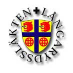
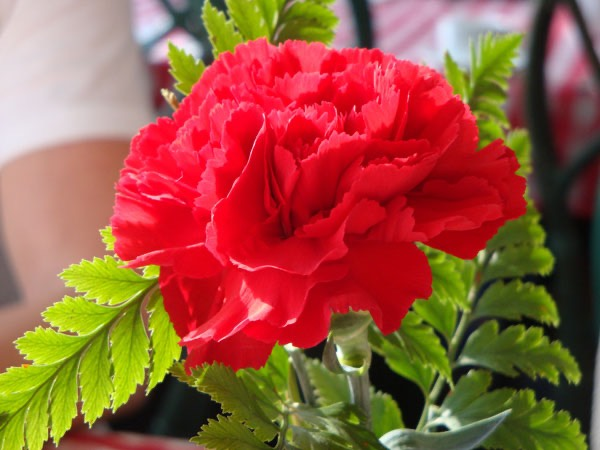

 

Vi bor på Södertörn, söder om Stockholm och är en del av Långarydssläkten - världens största kartlagda släkt - med ca 208.000 namn. Släkten har också en egen [hemsida](http://www.langarydsslakten.se/).

På följande sätt kan Du enkelt nå oss:

- **Postadress:** Fredriksbergsvägen 89, 136 67 VENDELSÖ
- **E-post:** [ivan@valfridsson.net](mailto:ivan@valfridsson.net) och [elsie@valfridsson.net](mailto:elsie@valfridsson.net)
- **Mobiltelefon:** 070-554 11 18 och 070-543 40 85
- **Skype:** ivaval

Skapades 1 januari 1997[http://www.haningekonstnarer.se/konst/bmolankar.php](http://www.haningekonstnarer.se/konst/bmolankar.php)

## Länkar

Ivan är webbmaster även för följande hemsidor:

- [Masten Socialt Center Tyresö](/masten/)
- [Darash](http://www.shalom.se/aldre/Darash/index)
- [Shalom](http://www.shalom.se/)
- [Cina Jeppsson](/cina/)
- [Pingstkyrkan Tyresö](http://www.tyresopingst.se/)
