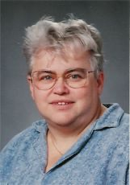

**Susannes bakgrund i korthet:**

Susanne föddes höstdagen den 22 oktober 1938 i den vackra lilla bergsstaden Silberberg, Tyskland. Hennes mor, Friedel, var av tysk börd och hennes far, Moses, var polsk jude. Susanne hade två äldre bröder, Friedrich och Werner. Det var då, strax före andra världskriget, orostider och judeförföljelser!

När Susanne var endast några veckor gammal häktades hennes far på gatan utanför deras hus och han fick lämna henne på trottoaren. Det blev början till en svår tid för familjen.

Fadern fördes till koncentrationslägret Buchenwald, varifrån familjen 9 månader senare lyckades få honom utvisad till Sverige.

Det blev en tuff och svår barndomstid. Susanne, de två äldre bröderna och modern bodde kvar i Silberberg under hela kriget. De levde under knappa förhållanden och i stor fara på grund av sitt ursprung. Efter kriget flyttades gränsen och området blev polskt.

Alla tyskar evakuerades men Susannes familj lämnades kvar som statslösa. Först hösten 1947 lyckades familjen att återförenas med fadern i Sverige - efter 9 års ofrivillig skilsmässa.

Susannes återförenade familj bosatte sig i Hässleholm. Susanne blev redan som ung aktiv i Missionsförsamlingen. Hösten 1959 träffade Susanne sin blivande livskamrat, Ivan - en smålänning, som gjorde sin militärtjänst på T4. Några år senare blev det bröllop på Torstarpsgården söder om Hässleholm. Susanne utbildade sig till sjuksköterska på Betanisstiftelsens Sjuksköterskeskola i Stockholm.

Susanne skapade ett öppet hem i Vendelsömalm i Haninge. Här har inte bara de egna tre barnen, Marita, Åsa och Daniel, fått värme, kärlek och stöd utan även ett flertal fosterbarn har här fått en fristad och ett hem. Med tiden växte familjen och hemmet fylldes till bredden med barnbarn, svärsöner och svärdöttrar, goda vänner, grannar och andra som gärna kom förbi.

Susanne har under sitt vuxna liv arbetat och engagerat sig främst för barn. De svaga i samhället fanns alltid nära hennes hjärta och hon gav ett aktivt stöd till utsatta barn, flyktingar och människor i sorg. Hon hade en särskild förmåga att se behovets barn.

Susannes andliga hem var [pingstförsamlingen i Tyresö](http://www.tyresopingst.se/). Där har hon främst varit aktiv inom själavård, sociala kontakter och hjälpverksamhet. Hon hade en stark och övertygande gudstro. Hon kände även en stark samhörighet med sitt judiska ursprung och fann många nära vänner i den judiska församlingen i Stockholm.

Susanne avled efter en kort tids sjukdom den 22 april 2000. Hennes sista tid finns beskriven i en [dagbok](dagbok/).
