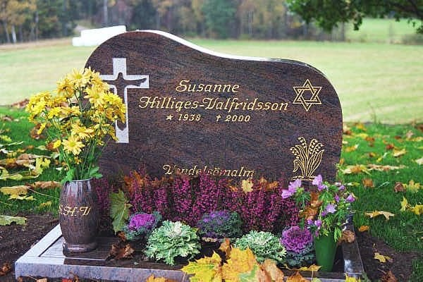
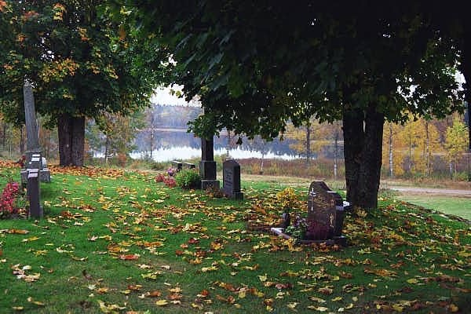

**Resumé**

Sedan flera år tillbaka har jag haft besvär och svårigheter med övre magmunnen. Vid tidigare undersökningar med bl a gastroskopi har det konstaterats att jag har brockbildningar som orsakar mina besvär. Under sommaren och hösten 1999 ökade mina besvär trots medicinering och jag började bli orolig för att det skulle vara något allvarligt. När jag så också började rasa i vikt tog jag kontakt med Gastroenheten på Ersta Sjukhus. I början av december fick jag komma dit och jag blev röntgad. Den 22 december blev jag uppringd av läkaren på Ersta och fick beskedet att det inte fanns någon cancer i magen. Det kändes skönt med det beskedet och min oro dämpades något. Läkaren sa vidare att eftersom jag hade så allvarliga besvär så skulle man planera in undersökningar för en eventuell operation av diafragmabrocket. Tider skulle meddelas senare. Med dessa besked for vi ner till Småland och firade jul och nyår där. Det blev en skön och fin helg trots mina magbesvär. Med stort besvär kunde jag äta något. Det var betydligt svårare att dricka. Det kändes som om vätskan fastnade i nedre delen av matstrupen.

Så småningom kom tiderna från Ersta - en syramätning och en gastroskopi i början av februari resp 15 februari. Det kändes avlägset med de besvär jag hade.

**2000-01-16**

Min kusin Helga från Tyskland ringde och frågade bl a hur vi mår och jag berättade om mina besvär och att jag inte fått undersökningstider förrän i februari. En halvtimme senare ringde hennes man, som är kirurg på sjukhuset i Burg på ön Fehmarn. Han tyckte att jag på måndag skulle ta första tåg ner till dem för att besöka dem. Jag ringde och beställde en tågbiljett och hämtade ut den senare på kvällen på Centralstationen.

**2000-01-17**

Jag tog morgontåget från Stockholms Central och efter fyra tågbyten var jag framme hos min kusin Helga på ön Fehmarn. Jag blev hämtad vid stationen och blev väl omhändertagen. Det var trevligt att återse dem och jag kände mig välkommen.

**2000-01-18**

Jag fick följa med Klaus, kusin Helgas man, till sjukhuset och blev inskriven där. Senare under dagen genomförde Klaus och en läkarkollega till honom en gastroskopi och konstaterade direkt att jag hade ett mycket stort cancersår i magsäcken. Den hade en svampliknande utbredning och växte upp i nedre delen av matstrupen. Klaus bedömde att en omedelbar operation var nödvändig. Jag blev chockad av beskedet. Det kändes fruktansvärt svårt att ringa hem och berätta. Jag ringde min dotter Marita och bad henne att så skonsamt som möjligt meddela min man och övriga i familjen.

När min man fått beskedet lämnade han arbetet direkt och for hem för att packa. Redan samma eftermiddag for han och vår son Daniel ner till Broaryd.

**2000-01-19**

Tidigt på morgonen for min man och vår dotter Marita vidare med bil ner till Fehmarn för att hämta mig.

**2000-01-20**

Med bil återvände vi till Broaryd.

**2000-01-21**

Med bil återvände vi till Stockholm.

**2000-01-24**

Under den gångna helgen hade Marita hört sig för bland kolleger och vänner om bästa vård för mig och kommit fram till att vi skulle välja Danderyds Sjukhus. Därför for vi till akuten på Danderyds Sjukhus på måndagsförmiddagen. Där blev vi väl omhändertagna och fick bl a träffa dr Jesper Lagergren. Han förberedde mig på att det skulle bli en mycket tuff och svår behandling - först med strålning och cellgifter och därefter en totaloperation med borttagning av hela magsäcken och en bit av matstrupen. Jag blev tilldelad avdelning 64 - men slapp att bli inskriven direkt. Det skulle ta några dagar att planera in alla erforderliga undersökningar.

**2000-02-02**

Inskrivning och inläggning på avdelning 64 på kvällen.

**2000-02-03**

Röntgen av hjärta, lungor och matstrupe.

**2000-02-04**

Ultraljudsundersökning inifrån matsäcken. Inget tyder på att cancern spridit sig utanför magsäcken och matstrupen.

**2000-02-07**

Överläkaren gör en gastroskopi och konstaterar att det inte är den cancerform man hittills planerat behandling för. Hans bedömning är att operationen skall genomföras snarast - helst redan på torsdag - utan föregående cellgiftsbehandling eller strålning.

**2000-02-08**

Genomgång av operationsprocessen.

**2000-02-09**

Utskriven från avdelning 64 i avvaktan på operationstid.

**2000-02-16**

Inläggning på avdelning 64 för förberedelse för operation.

**2000-02-17**

Avsikten var att avlägsna hela magsäcken och nedre delen av matstrupen och att koppla tunntarmen direkt mot resterande del av matstrupen. Under operationen upptäckte kirurgerna att cancern inte enbart var koncentrerad till magsäcken och matstrupen. Den hade även infiltrerat diafragmamuskeln och körtlar kring aorta. Läkarna bedömde situationen så allvarlig att man avbröt operationen utan att ta bort något av cancern. En sond lades in i tunntarmen via buken. Marita var på sjukhuset under operationen och kom ner till Uppvaket och var hos mej när jag vaknade upp efter operationen. Av henne fick jag det svåra beskedet att operationen inte hade kunnat fullföljas. Lite senare kom även min man. Under natten låg jag på Intensiven.

**2000-02-18**

Under eftermiddagen fördes jag åter upp till avdelning 64. Någon av mina nära var ständig hos mig.

**2000-02-19**

Sent på kvällen kom min dotter Åsa med familj hem från Kalifornien.

**2000-02-24**

Under de gångna dagarna har jag successivt återhämtat mig efter operationen. Dygnet runt har någon av mina nära varit hos mig. Igår kände jag mig dock febrig och idag konstaterades att jag fått blodförgiftning och kraftfull antibiotika sattes in.

**2000-02-25**

Trots att jag på grund av operationen och blodförgiftningen inte känner mig särskilt pigg upplevde jag en fin stund ikväll. Efter sjuksystrarnas rond rattade Ivan och jag in Radio Rörstrand och förbönsprogrammet - och vad får vi höra? Jo, Kjell Winberg och Stig Norrby lägger fram mig som ett allvarligt böneämne och ber för mig i radion över hela Stockholm. Det kändes som en direkt hälsning från Gud.

**2000-03-01**

Idag blev jag utskriven från sjukhuset och SAH (hemsjukvården) tar över ansvaret. Efter blodförgiftningen och den efterföljande antibiotikabehandlingen har jag inte fått behålla något mat eller dryck. Allt kräks jag upp och jag livnär mig helt på dropp via en inopererad dosa under huden.

Innan jag lämnade sjukhuset kom dr Sam Rotstein från Onkologen och berättade att man planerar att erbjuda mig cellgiftsbehandling för att om möjligt försöka begränsa alternativt krympa cancern. Han kunde inte lova någon bot. Han återkommer när behandlingsplanen är klar.

Fritz och Ella har glatt mig med besök här på Sjukhuset några dagar.

**2000-03-11**

Idag fick jag ett kärt besök av Werner, Liz och Gun-Marie. Det gladde mig mycket.

**2000-03-15**

Återbesök hos dr Näslund på Kirurgen på Danderyds Sjukhus. Han försökte byta ut buksonden, som redan tidigare på sjukhuset slammade igen och inte längre fungerade. Försöket misslyckades och sonden togs bort. Dr Näslund var inte nöjd med att jag fortfarande går ner i vikt och ordinerade ökande kaloriintag.

**2000-03-21**

Genomgång av den kommande cellgiftsbehandlingen hos dr Rotstein på Onkologen. Blodprovstagning inför behandlingen. Lång väntetid, som jag hade svårt att klara av på grund av vätskebrist (inget dropp under tiden).

**2000-03-22**

Första cellgiftsbehandlingen påbörjad med tvåtimmarsdropp. Det fungerade bra utan några reaktioner. Det var en stor lättnad för mig. Marita och Ivan var med mig.

**2000-03-23**

Fortsatt cellgiftsbehandling med tvåtimmarsdropp.

**2000-03-24**

Sista dagens tvåtimmarsdropp i denna cellgiftsomgång.

**2000-03-27**

Nu några dagar efter första cellgiftsomgången börjar en oerhörd trötthet komma och jag har även fått besvär med förhöjda sockervärden i blodet. Ibland känns det som om jag inte kommer att orka igenom detta. En verklig styrka är dock den fantastiska stöttning som jag ständigt får av familjen, arbetskamrater och vänner både inom och utanför kyrkan. Jag vet att många ber för mig och det känns skönt. Otaliga är de blommor, kort, brev, teckningar, telefonsamtal och e-postbrev som jag fått och fortfarande får. Allt detta värmer och styrker. Många berättar att de ber för mig och det känns särskilt skönt.

Något som glatt mig mycket under den här svåra tiden är den omtanke om min familj som en del vänner visat rent praktiskt genom att komma med lagat mat, bakade bullar och kakor. Andra har ställt upp och avlöst min man så att han bättre kunnat sköta sitt arbete.

**2000-03-29**

I eftermiddag fick jag besök av en perukmakare för val och utprovning av peruk. I flertalet fall tappar man håret i samband med cellgiftsbehandlingen.

**2000-04-04**

Under den gångna veckan har jag successivt återhämtat krafterna och till och med gått upp några kilo, men idag har jag känt mig sämre igen. Jag har fått feber och är infekterad i mina luftrör. SAH har satt in antibiotika. Dessutom har jag börjat att tappa håret. Rent logiskt visste jag att detta skulle ske och var förberedd på detta - men det blev jobbigt ändå när det verkligen hände.

**2000-04-06**

Idag reste Åsa, Felix och Max åter tillbaka till Kalifornien. Det känns tomt efter dem men jag inser att barnen och Åsa måste få träffa Mats.

**2000-04-08**

Solen skiner och det är fint väder. I söderläge och i lä är det skönt väder. Jag har en stund suttit ute på altanen och njutit av den begynnande våren och sett på när Ivan beskurit träden. Jag har haft relativt bra nätter på sistone och varit piggare på dagarna. Fortfarande kräks jag flera gånger om dagen och får inte behålla varken dryck eller mat oberoende hur försiktigt jag äter. Även om jag inte äter eller dricker kräks jag upp den magsaft som naturligt bildas i magsäcken.

**2000-04-09**

En stor trötthet har vilat över mig idag. Det är inga långa stunder jag orkat vara uppe och när jag ligger sover jag mest. I spåren efter cellgiftsbehandlingen och den senaste antibiotikabehandlingen har jag drabbats av ett aggressivt svampangrepp i munnen, som jag nu fått behandling för.

**2000-04-10**

Jag är något piggare idag och har haft en relativt bra natt. Jag orkar dock inte vara uppe någon längre stund. På förmiddagen var Solveig hos mig när Ivan arbetade. I eftermiddag fick jag oväntat besök av Birgitta och Gudmund från Ödesbacka. Det var trevligt.

Numera får jag en gång i veckan besök av en sjukgymnast som masserar min rygg. Eftersom jag ligger så mycket får jag ryggbesvär. Idag fick jag massage.

**2000-04-11**

Natten har varit förhållandevis bra. På förmiddagen skjutsade Ivan mig till Danderyds Sjukhus, dels för provtagning och dels för läkarbesök inför morgondagens cellgiftsbehandling. Läkaren bedömde att behandlingen skall fortsätta. Jag är mycket trött efter sjukhusbesöket och resorna till och från. I eftermiddag fick jag besök av Elisabeth och en stund senare tittade Eva Franklin in med en blomma och bakverk. Vilka änglar jag har till vänner!

Ikväll kommer Marita upp med tåg för att vara med mig på cellgiftsbehandlingarna de kommande tre dagarna. Det känns skönt.

**2000-04-12**

Andra cellgiftsomgången påbörjad med första dagens tvåtimmarsdropp. Det fungerade bra utan några reaktioner. Marita var med mig. Jag fick också svar på gårdagens blodprover. Jag hade anmärkningsvärt högt värde på antal vita blodkroppar. Jämfört med förra behandlingsomgången är jag nu betydligt svagare. Då gick jag själv från entrén in på behandlingen. Idag fick Marita låna en rullstol och köra mig.

I eftermiddag har jag mått betydligt sämre med massor av småkräkningar. Jag vet inte om jag orkar mer! Hoppas att jag får sova någorlunda och kan få lite krafter tillbaka inför morgondagen.

**2000-04-13**

Det blev en ganska bra natt med endast en kräkning och jag känner mig relativt pigg nu på morgonen och jag är beredd att åka in till Danderyd för behandling.

Andra dagens cellgiftsbehandling gick också bra och även om jag blir trött av resorna till och från sjukhuset så känner jag mig något bättre i eftermiddag än igår eftermiddag. Hoppas att det håller i sig.

**2000-04-14**

Det blev åter en ganska bra natt med endast en kräkning och jag känner mig relativt pigg nu på morgonen. Idag är det sista dagens tvåtimmarsdropp i den andra cellgiftsomgången.

På vägen in från bilen till sjukhuset inträffade en liten malör. Rullstolen lyckades slita av slangen från min smärtpump. I sjukhusapoteket fick vi tag i en ny slang och personal från smärtkliniken kom ner och bytte den. Själva cellgiftsbehandlingen förlöpte väl. Idag har jag haft en hel del uppstötningar från magen och nu när jag kommit hem känner jag mig oerhört trött och svag.

I eftermiddag gladde Sören mig med ett besök och en fin blomma.

**2000-04-15**

Natten blev relativt bra och jag kunde sova större delen. Två gånger var jag uppe och kräkte och tog extra doser via smärtpumpen. En god hjälp som gör mig lugn under natten är en fin CD-skiva, som jag fick av Gunnel och Carl-Åke vid deras besök tidigare. Den heter "Vid stilla vatten" (VIVA) och består av 27 andliga klassiker med panflöjt och orkester - en mycket mjuk och stilla musikskiva som ger mig ro.

Min dag har präglats av sömn. Jag har varit mycket trött och endast orkat stiga upp korta stunder med hjälp för de nödvändigaste behoven. Några kära vänner, Birgitta och Karin, samt arbetskamraten Kate med blommor från mina kolleger, fick ingen större glädje av mig idag när de besökte mig.

**2000-04-16**

Natten har varit ganska lik föregående natt - dock känner jag mig nog ännu svagare nu. Med Ivans hjälp duschade jag nu på morgonen och det var jobbigt - men skönt. Fortfarande sitter en del av håret kvar och jag har ännu inte börjat använda peruk. Det är svårt att ständigt känna sig torr i munnen utan att kunna dricka. Ivan har frusit in små saftkuber och små annanas-bitar som jag suger på en gång i timmen. Det är gott. För övrigt sover jag mest.

I kväll kom Marita upp med Isak och Lukas. De har påsklov den kommande veckan och skall då vara med Kenneth och Grete. Det var roligt att se och träffa Isak och Lukas. De har blivit så stora nu.

**2000-04-17**

Det blev en något bättre natt än föregående - men tröttheten är ännu mer påtaglig. Det känns ansträngande att ens lyfta en arm. Jag har sovit större delen av dagen. Besök idag: Solveig Ryberg och Miriam Lönnqvist.

**2000-04-18**

Natten har varit relativt bra - endast en extra dos via smärtpumpen. Jag är fortfarande mycket trött och svag och behöver Ivans hjälp för att resa mig ur sängen och göra toalettbesök. Jag behöver också hjälp varje gång jag får uppstötningar eller kräks.

Åter en sovdag med några korta vakentillstånd. Även om jag inte är vaken har det hänt en hel del idag. Sirkka har varit här och planterat om alla mina blomkrukor. Det känns skönt. Besök idag: Gunnel & Karl-Åke Bostedt och Ingvar Hellberg.

**2000-04-19**

En något sämre natt med mer medicinering och uppstötningar från magen. Dessutom började vänster fot och ben svullna igår kväll och jag har begränsad känsel på insidan av låret. Vid SAH:s rond på förmiddagen tillkallades en läkare som bedömde att det kunde vara en blodpropp i vänstra benet och läkemedel mot detta sattes in. Vidare diskuterades att eventuellt sätta in en sond via näsan ner i magsäcken för att försöka minska uppstötningarna och kräkningarna.

Åter en sovdag med några korta vakentillstånd, som dock kanske är aningen bättre än igår.

Besök idag: Karin Modin, Yvonne Österberg och Claes Hilliges med familj.

**2000-04-20**

Ungefär oförändrad natt mot tidigare. Känner mig fortfarande oerhört trött och svag. Jag kan inte själv resa mig upp ur sängen - men kan gå till toaletten. Nu på förmiddagen fick jag en sond insatt via näsan ner i magsäcken och direkt kom det upp flera deciliter med magsaft - ett par deciliter mindre att kräka. Skönt. Dock känns det lite obehaglig i svalget just nu. Hoppas det släpper snart.

Tack vare sonden har jag idag inte haft några kräkningar eller uppstötningar av maginnehåll. Detta är en stor lättnad både för mig och Ivan. Min trötthet har bestått under dagen och jag har sovit större delen av tiden.

Besök idag: Birgitta Johansson.

**2000-04-21**

Både Ivan och jag hade pratat om att vi äntligen skulle få en ostörd natt utan kräkningar och uppstötningar från magen - men vad fel vi fick. Visserligen fick jag inga kräkningar eller illamåenden men i stället satte magen (tarmarna) igång och jag fick med Ivans hjälp göra åtskilliga fler toalettbesök än tidigare nätter. I glädjen över att kunna dricka utan efterföljande illamående hade jag antagligen druckit för mycket saft för en ovan mage. Nu har Ivan börjat ge mig thé istället - inte lika gott.

Den mindre goda drycken fick avsedd verkan och toalettbesöken minskade. Nattens eskapader tog dock hårt på krafterna och jag har sovit större delen av dagen. Ännu inga kräkningar sedan sonden sattes in.

Besök idag: Renate och Linda.

**2000-04-22**

En mycket arbetsam natt med ett tiotal diarréer trots gårdagens thédrickande. Jag är alldeles slut och utmattad.

(Jag tror inte att jag orkar längre - så uttryckte hon sig flera gånger den sista tiden - men hela tiden hade hon en stark tro på Gud och Hans omsorg.

Efter en störtblödning via tarmen förlorade Susanne medvetandet och efter ca en halvtimme somnade hon lugnt och stilla in utan att ha återfått medvetandet. Klockan var då 12.30. Daniel och jag var hos henne och höll henne i handen när hon gick hem till himlen. Under eftermiddagen har Berit, Daniel, Sara och jag tvättat och klätt Susanne i hennes fina USA-klänning - den hon var så glad i och som hon hade på sig på vår gemensamma 120-årsfest. Vi tände hennes favoritljusstake, smyckade med blommor och lade en bibel och några rosor på hennes bröst. Jonas, Daniels son, kom med en av sina bilar och placerade den också på Susanne - så rart av honom. Den CD-skiva, som Susanne tidigare fått av Gunnel och Karl-Åke och som hon sedan dess ivrigt lyssnat på satte vi på med låg volym. Nu hade vi var och en tillfälle att i lugn och ro ta farväl av Susanne.

Lite senare kom Rode Kennerberg och höll en kort andakt med oss.

Klockan 16.30 kom transportbilen och Susanne fick sin sista fysiska transport från vårt hem. Saknaden är oerhörd!!!!

Under eftermiddagen försökte vi nå och meddela släkt, vänner, församling och arbetskamrater. Vi kunde nå de flesta.

På kvällen kom Marita, Markku och Adam upp från Småland.

Besök: Kerstin Fredlund./ Ivan)

## EPILOG - skriven av Ivan

**2000-04-23**

Under förmiddagen informerade jag personligen grannarna och vi började planera för begravningen. Enligt önskemål från Susanne skall gravsättningen ske i Södra Hestra. Marita sökte och fick tag på en präst, som lovade ställa upp. Han föreslog någon av dagarna 3-4/5. Definitivt besked kan vi inte få förrän på tisdag då kyrkogårdsförvaltningen kan kontaktas. Österhaninge församling har gett klartecken. Under förutsättning att Södra Hestra församling ger klartecken och att transporterna kan ordnas (besked på tisdag då begravningsbyrån kontaktas) gäller följande preliminära planering:

---

*Se justerat program den 25/4!*

---

Därefter åt vi middag tillsammans med Sara och Renate & John Holmqvist.

Under eftermiddagen fick vi kondoleansbesök: Sören Valfridsson med hälsningar från familjen Stenbaek, Elisabeth Westerlund, Birgitta & Sven-Erik Johansson, Lillemor Floden och Kjell Winberg. Därutöver har jag fått ett stort antal e-postbrev med kondoleanshälsningar från när och fjärran.

Vid telefonsamtal med Åsa ikväll fick jag beskedet att hon och Max kommer över till begravningen från Kalifornien.

**2000-04-24**

En kondoleansdag - personliga besök: Annika & Gunnar Pettersson, Ingrid & Lars Grundström, Solveig & Ken Ryberg, många telefonsamtal och en stor mängd e-postbrev från när och fjärran. Idag åkte Markku, Isak och Lukas åter ner till Hultabo i Småland. Marita är kvar tills vidare.

**2000-04-25**

Genomgång med begravningsbyrån, beställt transporter, kista, kistdekoration och fastställt dagar och tider. Se programmet nedan.

---

### Begravningsgudstjänst i Tyresö Pingstkyrka den 1/5, kl 14.00

- Ingångsmusik - Claes Hilliges - Vila
- Solosång - Camilla Stenman - Jag vet att min förlossare lever
- Välkomstord
- Psalm 303:1-4 - Det finns en väg
- Solosång - Camilla Stenman - Der Herr ist mein getreuer Hirt
- Begravningsakt - Göran Skoog
- Bön - Fader vår
- Solosång - Camilla Stenman - Vad är döden
- Gemensam sång - Nåd över allt förnuft
- Välsignelsen
- Psalm 190:1-3 - Bred dina vida vingar
- Avskedstagande med defilering
- Utgångsmusik - Det finns djup i Herrens godhet
- Minnesstund med kaffe i församlingsvåningen

### Gravsättning i Södra Hestra den 3/5, kl 14.00

- Procession från gravkapellet till graven
- Psalm 285:1-3 - Det finns djup i Herrens godhet
- Bibelläsning
- Bön
- Fader vår
- Välsignelsen
- Psalm 297:1-3 - Härlig är jorden
- Avsked
- Minnesstund i församlingshemmet

---

Fortsatta kondoleanser: Sirkka & Rune Björkmyr, ett antal blomsterbud, e-postbrev och många telefonsamtal.

**2000-04-26**

För Er som inte har någon av tidningarna Dagen eller Svenska Dagbladet kopierar jag in annonstexten här nedan. Enligt löfte skall annonsen vara med i morgondagens tidning.

---

Vår älskade  
**Susanne H-Valfridsson**  
\*22/10 1938  
har idag flyttat hem.  
Vendelsömalm påskafton 22/4 2000  
Vi känner djup sorg och saknad!

Ivan  
Barn  
Fosterbarn  
Barnbarn  
Släkt  
Vänner  
Arbetskamrater  
Pingstförsamlingen Tyresö

------------

Nåd över allt förnuft  
nåd över alla gränser  
allting den överglänser  
nåden som Herren ger

_________________________________

Begravningsgudstjänst äger rum  
den 1 maj kl 14.00  
i Pingstkyrkan Tyresö.

Gravsättning sker den 3 maj kl 14.00  
i Södra Hestra Kyrka.

-----------------

Tänk gärna på Lettlandshjälpen!  
Postgiro 88 25 36-6

_________________________________

---

Idag har det för mig varit en "normal" arbetsdag - åtminstone har jag försökt att få det att bli så. Det blev dock bara en halv dag eftersom SAH önskade komma och hämta utlånade hjälpmedel och överbliven materiel.

Ikväll kom Maude ut och ville prata och sörja tillsammans med oss.

**2000-04-27**

Arbetat på förmiddagen. Under eftermiddagen har jag efter besök i 8 bok- och pappersaffärer lyckats få fram lämpligt papper och tryckt upp programmet för begravningen. Fortsatta kondoleanser i form av brev och telefonsamtal.

**2000-04-28**

Hel arbetsdag. Ikväll kom Berit Jansson med en blomma och kondoleanskort. Med posten kom ytterligare ett antal brev.

Under dagen hade jag ett samtal med begravningsbyrån för en sista kontroll av att allt är förberett inför begravningen. Det återstår nu att ordna ett antal bärare som hjälper till att ta in kistan en timme före begravningen.

**2000-04-29**

Mitt på dagen kom Markku, Isak och Lukas upp från Småland. Marita och Adam har varit hos mig hela veckan. I eftermiddag har vi grillat ute i trädgården. Det var varmt och skönt väder.

Idag har Daniel utformat och jag tryckt upp programmet för gravsättningen på Södra Hestra kyrkogård på onsdag.

**2000-04-30**

En mycket vacker och skön dag med solsken och värme. Marita har hjälpt mig en del i trädgården, Markku har försökt att fixa ett fel på sin bil och Daniel och jag försökte starta min MC. Batteriet hade dock laddat ur sig under vintern och vi fick sätta det på laddning.

På kvällen kom vår pastor Göran Skoog på besök och vi samtalade en del om Susanne, om vad som hänt och om den kommande begravningen. Vi avslutade med en bönestund.

Klockan 22.45 mötte Marita och jag Åsa och Max på Arlanda och nu är familjen samlad inför morgondagens begravning. Resan över hade gått bra.

**2000-05-01**

Begravningsdagen. Strax efter 12.00 for Daniel, Marita, Markku och jag till Pingstkyrkan. Kl 12.40 kom begravningsbilen med kistan och vi tillsammans med Fritz, Claes och några andra bar in den. Därefter kom en blomsterdekoratör och smyckade kistan och arrangerade blommor och kransar runt kistan. Huvudblommorna i kistdekorationen bestod av röda rosor och vita liljor. Arrangemanget blev bra. Jag tillsammans med de närmaste släktingarna samlades sedan i ett rum för att låta begravningsgästerna ta plats i kyrksalen. Strax före 14.00 gick vi upp till foajén och under ingångsmusiken tog vi plats på höger sida längst fram, där fyra bänkrader reserverats för oss. Mycket folk hade samlats och kyrkan var så gott som full.

Det blev en ljus och mycket finstämd begravningsgudstjänst - ett fint minne. Officiant var Göran Skoog, solist Camilla Stenman, musiker Claes och Fritz Hilliges. I avslutningen genomfördes en defilering där flertalet gick fram och under mycket tårar och med många blommor tog farväl av Susanne. Hon hade verkligen många vänner!

Efter gudstjänsten bjöds alla närvarande ner i församlingsvåningen till en minnesstund med kaffe, bullar, kakor och tårta. Här hölls många tal från både släktingar, arbetskamrater, grannar, vänner och församlingen. Jag skulle önska att Susanne på något sätt skulle kunna förnimma den kärlek och värme som denna dag strömmat emot henne. Jag vet att hon redan under sjukdomstiden fått del av och tog till sig detta genom alla blommor, brev, teckningar från barnen och besök.

Under minnesstunden inkom gåvor till Lettlandshjälpen på över 5.000 kr. Därtill kommer de gåvor som insätts på postgirokontot 88 25 36-6, som ännu ej redovisats. Vi är mycket tacksamma för detta.

En serie fotografier från begravningen och minnesstunden i Pingstkyrkan Tyresö finns inlagda [här](http://valfridsson.net/ivan/foto07.htm).

**2000-05-02**

Under förmiddagen reste Marita med familj ner till Småland och strax efter klockan två startade Renate med familj, Daniel med familj och jag med Åsa, Max och Sara vår resa till Småland. Med Renate åkte också Laide (Claes kunde inte vara med) och med Daniel åkte Tom. Vi stannade vid Herbeta och fikade. Renate och hennes familj övernattar hos Bengt Haraldsson. Väl framkomna bjöd Marita och Markku oss alla på mat.

**2000-05-03**

Gravsättning av Susanne på Södra Hestra kyrkogård. Trots familjen och många vänner, soligt och vackert väder, intensiv fågelsång, blommande träd, var detta mitt livs svåraste dag. Att stå där vid den öppna graven och se sin älskade hustru sänkas ner i jorden var svårt även om jag vet att hon inte längre är där. Det blev så påtagligt att hennes frånvaro nu är ett oåterkalleligt faktum. Jag hade stora svårigheter att formulera mina avskedsord vid den öppna graven. Det var nog fler än jag som kände så. Det förstod jag efteråt.

Efter gravsättningen inbjöds de närvarande till en minnesstund i Sockenstugan. Det blev omkring 50 gäster som kom dit och vi fick skinka- och ostsmörgåsar samt Småländsk Ostkaka med kaffe. Det var fint dukat och det smakade gott. Irene Mårtensson och Bodil Samuelsson hade på ett förtjänstfullt sätt ordnat detta. **Tack för det!**

Ida Mårtensson hedrade Susanne med att spelade ett pianostycke, vi sjöng några psalmer och några höll tal. Vid utgången stod ett kärl för en minnesgåva till Lettlandshjälpen. Det kom in 2.055:50 kr.

**Ett varmt tack till alla som på olika sätt hedrat Susannes minne och gjort det lättare för mig och familjen! Må Gud rikligen välsigna Er alla!**

En serie fotografier från gravsättningen på Södra Hestra kyrkogård finns inlagda [här](http://valfridsson.net/ivan/foto08.htm).

**2000-05-10**

På fredag kommer nedanstående tackannons att publiceras i tidningarna Dagen, Svenska Dagbladet och Dagens Nyheter.

-------------------------------------

*Till alla som med böner,  
brev och blommor eller  
på annat sätt stöttat  
vår älskade  
**Susanne H-Valfridsson**  
under hennes sjukdomstid,  
och som hedrat hennes minne  
med blommor vid graven och  
gåvor till Lettlandshjälpen  
framför vi vårt varma tack!  
FAMILJEN*

-----------------------------------------

**2000-05-11**

Ingvar Hellberg, ansvarig för Lettlandshjälpen, ringde mig ikväll och berättade att det hittills kommit in över 20.000 kr till Susannes minne i gåvor till Lettlandshjälpen. Verkligen roligt! Detta arbete låg nära Susannes hjärta. **(Totalt slutredovisades 23.250 kr som kom in till Susannes minne via Lettlandshjälpen.)** **Ett varmt tack!**

**2000-05-16**

Följande minnesruna finns införd i tidningen Dagen idag. Den har också sänts in till tidningarna Svenska Dagbladet och Dagens Nyheter men när och om den publiceras vet jag inte.

---

***TILL MINNE***

**Susanne Hilliges-Valfridsson** har efter en kort tids cancersjukdom fått flytta hem. Hon fick somna in fridfullt i hemmet bland sina kära.

Susanne föddes en höstdag 1938 i den vackra lilla bergsstaden Silberberg, Tyskland. Hennes mor var av tysk börd och hennes far var polsk jude. Det var orostider och judeförföljelser!

När Susanne var endast några veckor gammal häktades hennes far på gatan utanför deras hus och han fick lämna henne på trottoaren. Det blev början till en svår tid för familjen.

Fadern fördes till koncentrationslägret Buchenwald, varifrån familjen 9 månader senare lyckades få honom utvisad till Sverige.

Det blev en tuff och svår barndomstid. Susanne, två äldre bröder och modern bodde kvar i Silberberg under hela kriget. De levde under knappa förhållanden och i stor fara på grund av sitt ursprung. Efter kriget flyttades gränsen och området blev polskt.

Alla tyskar evakuerades men Susannes familj lämnades kvar som statslösa. Först hösten 1947 lyckades familjen att återförenas med fadern i Sverige - efter 9 års ofrivillig skilsmässa.

Susannes återförenade familj bosatte sig i Hässleholm. Susanne blev redan som ung aktiv i Missionsförsamlingen. Hösten 1959 träffade Susanne sin blivande livskamrat, Ivan - en smålänning, som gjorde sin militärtjänst på T4. Några år senare blev det bröllop på Torstarpsgården söder om Hässleholm. Susanne utbildade sig till sjuksköterska på Betanisstiftelsens Sjuksköterskeskola i Stockholm.

Susanne skapade ett öppet hem i Vendelsömalm i Haninge. Här har inte bara de egna tre barnen fått värme, kärlek och stöd utan även ett flertal fosterbarn har här fått en fristad och ett hem. Med tiden växte familjen och hemmet fylldes till bredden med barnbarn, svärsöner och svärdöttrar, goda vänner, grannar och andra som gärna kom förbi.

Susanne har under sitt vuxna liv arbetat och engagerat sig främst för barn. De svaga i samhället fanns alltid nära hennes hjärta och hon gav ett aktivt stöd till utsatta barn, flyktingar och människor i sorg. Hon hade en särskild förmåga att se behovets barn.

Susannes andliga hem var pingstförsamlingen i Tyresö. Där har hon främst varit aktiv inom själavård, sociala kontakter och hjälpverksamhet. Hon hade en stark och övertygande gudstro. Hon kände även en stark samhörighet med sitt judiska ursprung och fann många nära vänner i den judiska församlingen i Stockholm.

Susanne lämnar ett mycket ljust minne efter sig och vi har hoppet att snart återses! Dock känns tomrummet efter henne mycket stort för mig och för våra barn, fosterbarn, barnbarn, övriga släktingar, vännerna, arbetskamraterna och församlingen.

**Ivan Valfridsson**

---------------------------------------------

  
Susannes gravvård på Södra Hestra kyrkogård den 7/10 2000.

  
En höstbild från Susannes gravplats den 7/10 2000.
