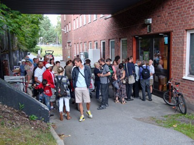
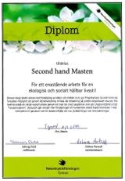

Varmt välkommen att fynda och därmed hjälpa andra! Allt överskott går till vårt hjälparbete bland nödställda, både här i vårt närområde och ut över världen. Vi är noggranna med att de medel vi får in verkligen når fram.

När det gäller projekt och katastrofhjälp utomlands samarbetar vi med kända organisationer, främst [Läkarmissionen](http://www.lakarmissionen.se/zino.aspx?articleID=634) och [PMU](http://www.pmu.se/om_pmu/), som har kontroll ända fram till användarna.

Vi är säkra på att medlen kommer till nytta där de bäst behövs, vilket vi fått många vittnesbörd om.

**Välkomna att fynda och därmed hjälpa andra!**

**Har Du saker/prylar att skänka? Släng inget som går att återanvända!**\
**OBS. Allt skall vara rent, helt och användbart! OBS**\
Under öppettiderna mottages möbler, saker, prylar, cyklar, verktyg m m för försäljning på Bollmora Gårdsväg 4, 135 39 Tyresö.\
Allt överskott går till vår hjälpverksamhet bland nödställda!

**Arrangör:** Pingstkyrkans Second Hand i Tyresö, tel 08-712 90 12\
**Hjälpverksamhetens Bankgiro:** 471-1727\
**E-post:** [secondhand@tyresopingst.se](mailto:secondhand@tyresopingst.se)

**Välförtjänt utmärkelse till grundarna av Masten Second Hand - Tyresö** - läs vidare [här](http://www.valfridsson.net/pkty/IngvarHellberg.htm)!
