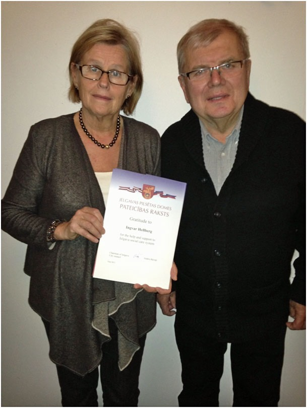
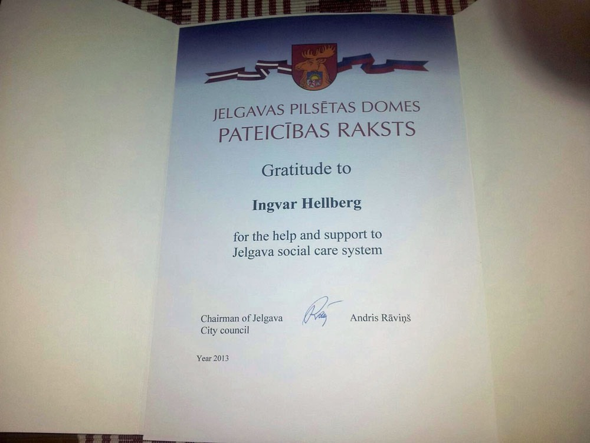

Fredagen den 4 januari 2013 var Ingvar Hellberg kallad till borgmästaren i Jelgava för att mottaga ett välförtjänt diplom, som bevis för deras stora uppskattning av vårt mångåriga sociala stöd och arbete genom Lettlandshjälpen och sedermera vår Second Hand-verksamhet! Primus motor i detta omfattande arbete har Ingvar Hellberg varit med stort stöd av hustrun Evy. I ceremonin i Jelgava deltog från Sverige förutom Ingvar och Evy även journalisten Tord Carlid.

"Roligt för oss alla som har jobbat och fortfarande jobbar med det viktiga arbetet på Second Hand!", uttryckte Ingvar vid hemkomsten.

**Välförtjänst utmärkelse till grundarna av Masten Second Hand – Tyresö**\
*Ingvar och Evy Hellberg fick diplom för sin kärlek till Lettland*

Vid en stor fest i en konferenslokal i centrala Jelgava i Lettland fick makarna Evy och Ingvar Hellberg från Tyresö under trettonhelgen ta emot en utmärkelse från stadens borgmästare Andris Ravins.

Makarna får utmärkelsen som bevis för staden Jelgavas stora uppskattning av det mångåriga sociala stöd och arbete som utförts genom Lettlandshjälpen och sedermera Pingstkyrkan Second Hand i Tyresö.

Under 21 år har makarna Hellberg tillsammans med ett 60-tal frivilligarbetare byggt upp ett imponerande hjälparbete både i Tyresö och i staden Jelgava i centrala Lettland.

– Det kändes verkligen roligt för oss alla som har jobbat och fortfarande jobbar med det viktiga arbetet på Second Hand, att få detta diplom som ett erkännande, säger Ingvar Hellberg.

Vid diplomutdelningen i Jelgava kände Ingvar och Evy Hellberg att de två främst fick utmärkelsen för deras kärlek till Lettland och dess folk. Ingvar Hellberg påmindes då om mötet 1990 med pingstpredikanterna från det forna Sovjetunionen, dit Lettland då tillhörde. När pastorerna besökte Tyresö i samband med Predikantveckan i Filadelfiakyrkan, Stockholm, bad de om hjälp till det fattiga Lettland, och fick löfte om hjälp framöver, när situationen i landet hade förbättrats.

Vid detta möte 1990 kände makarna Hellberg plötsligt kärlek till ett folk och till ett land, där de aldrig hade varit – till Lettlands folk. När Ingvar Hellberg gjorde sin första resa till Jelgava i oktober 1991, kände han att "det var hit som Herren ville att vi skulle åka och att vi här i praktisk handling skulle visa kristen medmänsklig kärlek till människorna".

I Tyresö startade man 1991 en stor second hand-verksamhet, som skulle ge pengar till Lettlandshjälpen, som verksamheten först kom att kallas. Under de gångna 21 åren har man fått in drygt 20 miljoner kronor, som gett hjälp till både Lettland, övriga Östeuropa och till många andra länder. Numera går hjälparbetet under namnet Masten Second Hand Tyresö.

Den första hjälptransporten till Lettland skedde i oktober 1991, endast två månader efter att Lettland blev fritt från det kommuniststyrda Sovjetunionen. Under åren har man fått iväg över 100 hjälpsändningar från Tyresö till Lettland. År 2010 startade man en second hand-butik i centrala Jelgava. Alla varor som säljs där kommer från Tyresö. Eldsjälen för verksamheten i Jelgava är Viktor Philipchuk.

I Jelgava startade makarna Hellberg ett soppkök, som under 15 år blev en livlina för samhällets utslagna. Huvudman var Lettlandshjälpen i samarbete med den lokala hjälpverksamheten Morningstar, understödda av pingstförsamlingen i Jelgava.

Lettlandshjälpen lät också renovera barnavdelningen på det stora slitna psykiatriska sjukhuset i Jelgava, så att sjukhusets skamfläck blev en mönsteranläggning som personalen är stolt över.

Numera går hjälparbetet vid Masten under namnet Masten Second Hand Tyresö. Det är en av få kristna second hand-butiker i Sverige som inte är knuten till en riksorganisation. I Tyresö ger second hand-försäljningen pengar till den viktiga lokala LP-verksamheten.

**Tor Carlid**

*Diplomet som tilldelats Ingvar Hellberg. Foto: Ingvar Hellberg*
